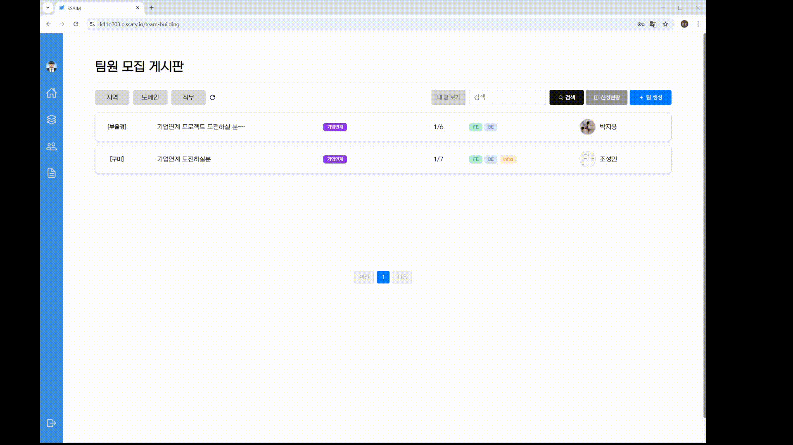
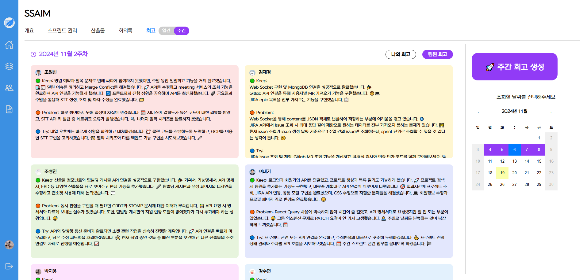

# 1. 팀 구성 게시판

| 1. 프로젝트 모집 생성 | 2. 프로젝트 생성 |
|:---|---:|
|  |  |

- 팀 생성 클릭
    - 시작일자: 오늘
    - 종료일자: 11.30
    - 부울경
    - 제목 : 임시 생성
    - 본문 : 실력자 모집합니다.
    - 도메인 : 자율-자유주제 (예외 상황 클릭해보기)
- 다른 팀원 지원 멘트 작성
- 모집 현황 5명
- 팀 구성 완료
- 프로젝트 생성창
    - 프로젝트 이름
    - 팀 이름
    - 나머지 팀원은 검색해서 추가

# 2. 산출물 → 프로젝트의 첫주 ! 기획단계에서

| 1. 산출물 생성 | 2. 동시 편집 |
|:---|---:|
|  |  |


- 기획서 딸깍 → 4~5초 정도 걸림
    - 주요 기능 3가지 넣기
        
        주요기능
        
        1. 대시보드 조회 및 Jira 관리
        2. 산출물 AI 자동생성 및 동시 편집
        3. 회의 음성 인식 및 화자 분리
- 기능 명세서 동시 편집
    - 다른 팀원들이 산출물 발표 순서일때 대기해서 같이 쳐주기 (기능명세서)
    - 이거 시체 생길 수 있으니깐 그냥 이 페이지에만 있도록 하기
- API 명세서는 보여주기만 하기
- ERD 사진 넣기

```
원활한 진행을 위해 미리 생성해둔 프로젝트에서 진행하도록 하겠습니다.
먼저 저희 프로젝트 기획서를 작성해보겠습니다. AI 자동생성을 활용해서 주요 기능 3가지를 넣으면 알아서 기획서를 작성해주고 있는 모습입니다.

다음 기능 명세서로 가볼까요?
다른 팀원들이 수정하고 있는 모습을 확인할 수 있고 동시 편집이 가능합니다.
마찬가지로 API명세서 또한 AI 자동생성 및 동시 편집이 가능합니다.
ERD는 사진을 첨부하여 관리할 수 있습니다.

```
# 3. 스프린트 관리 → 월요일 아침 지라

| 1. 지라 이슈 생성 |
|:---:|
|  |

- 새 스프린트 생성
- 이름: 자율 프로젝트 발표
- 목표:
- AI 자동생성
    - 월요일, 화요일 이슈만 만들어줘 프롬프트 입력하기
    - 기다리는 동안 → 10초 +-1
    - 저장하기 클릭
    - 기다리는 동안 (이게 젤오래 걸림)  → 20초 정확하네요
        - 스프린트 관리에서 지라 옮겨서 실제 지라에 반영이 되는지 확인 → f11 이후 컨트롤 1, 2로 움직이기
        - **대시보드에 화요일 완료인 jira 이슈 반영 되는지 확인**
        - 컨트롤 1, 2 로 움직이기 → 실제 지라 반영되는거 보여주기

```
이제 어느 정도 산출물이 만들어졌으니, 이제 지라 스프린트 생성해보겠습니다.
이번주의 스프린트를 생성하고 AI 자동생성을 활용해서 이슈를 만들어보겠습니다. 이번주는 월요일, 화요일 이슈만 만들어달라고 요청해보겠습니다.

(이슈 생성 기다리는 동안에 멘트)
AI 이슈 자동 생성은 기존에 작성된 API 명세서와 아까 작성했던 프롬프트를 기반으로 하루에 스토리 포인트 8포인트씩 이슈 초안을 생성해주고 있습니다.

(이슈 저장 클릭 → 탭 이동)

이슈 저장을 기다리는 동안, 실제로 이번 주 지라가 반영되는 모습을 보여드리겠습니다.
원빈님의 지라에 있는 '할 일' 항목 중 ‘자율 PJT 발표’ 이슈를 보이시나요?
이제 이 이슈를 저희 프로젝트로 옮겨보겠습니다.
완료 딸깍 -> 원빈님의 지라를 확인해보면 반영된 모습을 확인할 수 있습니다.

```
# 4. 회의록 → 매일 아침의 스크럼

| 1. 회의록 생성 | 2. 회의록 조회 |
|:---|---:|
|  |  |

누군가 기록하지 않더라도 말해줌

- 회의 생성 → 8초짜리 2명 기준 1초 걸림
    - 제목: 발표 회의
    - 팀원 전체 선택
    - 안녕하십니까, 발표자 강수연입니다./ 안녕하십니까, 시연자 조원빈입니다.
    - 중지
- 미리 생성해둔 회의록 조회
- 사운드테스트 해야됨, 아침에! ㅇㅋㅇㅋ
    - 오전 스크럼 클릭
    - 재생 버튼 클릭
    - 형광펜 자동 스크롤
    - 화자 수정
    - 스트립트 수정
    - AI 요약 보여줌 → 4초 걸림

```
다음은 회의록입니다.
회의 생성 한 번 해볼까요? 제목과 참여자를 선택하겠습니다.
안녕하십니까, 발표자 강수연입니다.
(원빈) 안녕하십니까, 시연자 조원빈입니다.
(중지 버튼 클릭) 이제 음성 인식과 화자 분리가 된 결과를 확인할 수 있습니다.

저희가 실제 진행했던 오전 미팅 스크럼 회의록 조회를 해보겠습니다. 
한 번 재생해볼까요? 
음성 싱크에 맞춰서 특정 스크립트가 형광펜으로 강조되고 있는 모습입니다.
이름을 클릭하면 팀원 중에서 화자 선택이 가능하고, 
스크립트를 클릭하면 수정을 할 수 있습니다. 
AI 요약 생성을 클릭하면 해당 회의록을 기반으로 
“주제/의견/방향성” 에 맞춰진 요약을 확인할 수 있습니다.

```
# 5. 회고

| 1. 일일회고 | 2. 주간회고 |
|:---|---:|
|  |  |

- 일일 회고 오늘 날짜로 작성 + 이전 회고 조회 가능 언급만 하기
- 일일 회고 (1일) 팀원 회고 저번주 아무거나 클릭
- 일일 회고(1주일) 클릭 아무 팀원 클릭
- 일일 회고(1주일) 나의 회고 클릭

- 주간회고 이동 클릭
    - 주간 회고 생성 → 11월 3주차 주간 회고 생성 → 7초 걸림
    - 기다리는 동안  (공통→ 특화 때 필수였잖아ㅋㅋ 금요일 오후되면 회고내세요~ 귀찮았는데 이거 쓰면 딸깍되네 느낌으로 말하기?)
    - 다른 탭에서 팀원 회고 조회

```
다음은 회고 부분 입니다.
일일 회고에서는 하루 단위의 나의 회고와 팀원 회고를 확인할 수 있고
일주일 단위의 나의 회고와 팀원 회고 또한 확인할 수 있습니다.

주간 회고로 이동해보겠습니다.
주간 회고는 본인이 작성한 1주일 치의 일일 회고를 기반으로 자동 생성이 가능합니다. 
저번주의 일일 회고를 기반으로 주간 회고를 생성해보겠습니다.
여러분 혹시, 공통 프로젝트와 특화 프로젝트 때, 
금요일 오후 5시쯤 스프린트 회고 작성해서 제출했던 거 기억나시나요? 
이제 이렇게 버튼 하나 딸깍이면 분위기에 맞는 이모지와 함께 
주간 회고를 생성할 수 있습니다.

```
# 6. 우개이

| 1. 우개이 목록 | 2. 우개이 조회 |
|:---|---:|
|  |  |

- 목록 클릭 → ssaim 프로젝트 클릭
- 책 넘김
- 다시 회고 클릭 → 생성 클릭
- 책 넘김
- (팀장님 다른 프로젝트도 생성해서 회고 생성해야할 듯!) → 진행중!

```
이제 마지막으로 '우리들의 개발 이야기' 기능을 시연해보겠습니다.
목록에서 저희 SSAIM 프로젝트를 선택해볼까요?
책을 넘길 때마다 아까 작성했던 주간 회고와 
이를 기반으로 생성된 이미지와 함께 확인할 수 있습니다.

이번에는 다시 돌아가서 생성 버튼을 클릭해보겠습니다.
모든 프로젝트의 이야기가 한 권의 책으로 만들어집니다.
공통 프로젝트, 특화 프로젝트, 그리고 자율 프로젝트까지, 모든 여정이 담겨 있습니다.

지금까지 우리는 한 권의 책을 함께 써 내려왔습니다.
첫 페이지는 공통 프로젝트에서의 작은 시작이었고,
중간에는 특화 프로젝트에서의 열정과 도전이 가득했습니다.
그리고 이제, 자율 프로젝트라는 마지막 페이지를 넘기고 있습니다.

여러분도 저희 서비스를 통해 본인만의 개발 이야기를 만들어보시는 건 어떨까요?

```
